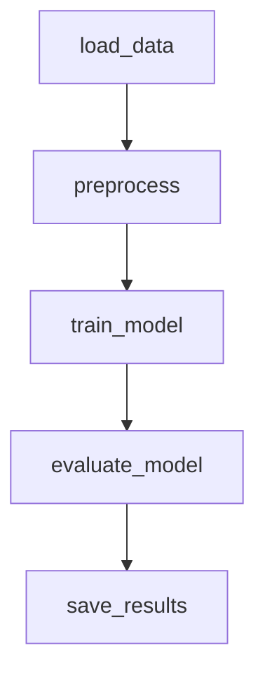
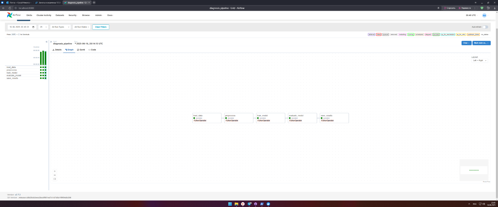
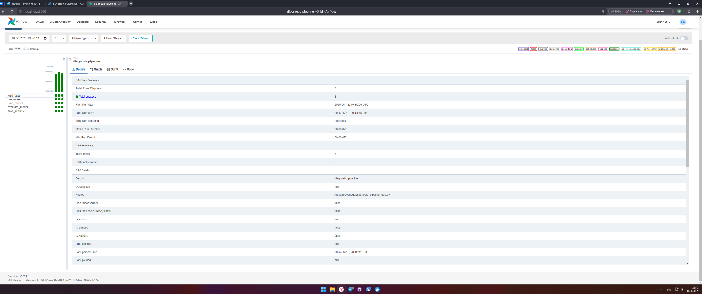

# ETL-пайплайн для диагностики заболеваний

##  Содержание
- Цель проекта
- Архитектура и структура проекта
- Этапы пайплайна
- Инструкция по запуску
- Интеграция с локальным хранилищем
- Устойчивость и анализ ошибок
- Идеи для улучшения
- Скриншоты

---

## Цель проекта

Целью проекта является разработка воспроизводимого и масштабируемого ETL-пайплайна для автоматизированной обработки медицинских данных, направленного на диагностику онкологических заболеваний (в частности, рака молочной железы). Пайплайн реализован с использованием Apache Airflow для оркестрации всех этапов: от получения данных из открытого репозитория до расчёта метрик качества обученной модели и сохранения результатов.

Проект решает задачу бинарной классификации (доброкачественная или злокачественная опухоль) на основе признаков, полученных из медицинских обследований. Решение построено на базе логистической регрессии, что обеспечивает интерпретируемость модели и высокую скорость работы.

---

## Архитектура

- `etl/` — модульные скрипты обработки, обучения и оценки
- `dags/` — DAG Airflow
- `results/` — сохранённые артефакты (`model.pkl`, `metrics.json`, архивы)
- `logs/` — логи Airflow
- `.env` — переменные окружения (включая FERNET_KEY)
- `Dockerfile` + `docker-compose.yml` — контейнеризация

###  Схема пайплайна (визуализация):



---

##  Описание шагов пайплайна

1. **load_data** — загрузка датасета Breast Cancer Wisconsin с UCI через `ucimlrepo`
2. **preprocess** — нормализация признаков, train/test split
3. **train_model** — обучение LogisticRegression
4. **evaluate_model** — расчёт Accuracy, Precision, Recall, F1
5. **save_results** — сохранение модели, метрик и архивация по дате

---

## Запуск проекта

### 1. Построение и запуск контейнеров
```bash
docker compose build
docker compose up -d
```

### 2. Инициализация Airflow
```bash
docker compose run --rm airflow airflow db init
```

### 3. Создание админа
```bash
docker exec -it airflow_pipeline airflow users create `
  --username admin `
  --password admin `
  --firstname airflow `
  --lastname admin `
  --role Admin `
  --email admin@example.com
```

### 4. Заход в UI
```
http://localhost:8080
```
Логин: `admin`, пароль: `admin`

---

##  Интеграция с хранилищем

- Используется **локальное хранилище**
- Результаты сохраняются в `results/`:
  - `model.pkl` — сериализованная модель
  - `metrics.json` — метрики
  - `archive/YYYY-MM-DD/` — сохранённый артефакт

Формат:
```json
{
   "accuracy": 0.9736842105263158,
   "precision": 0.9761904761904762,
   "recall": 0.9534883720930233,
   "f1_score": 0.9647058823529412
}
```

---

##  Устойчивость и обработка ошибок

### Возможные сбои и что сделано:
| Точка сбоя                                | Решение                                                    |
|-------------------------------------------|-------------------------------------------------------------|
| Источник данных недоступен (`ucimlrepo`)  | Обёрнут в try/except, логируется                           |
| Пропущенные значения в данных             | Проверка и логика очистки перед split                      |
| Модель не обучается (ошибка fit)          | Логирование и fallback                                     |
| Ошибка сериализации                       | Проверка пути и прав на папку `results/`                   |
| База не инициализирована                  | Явная команда `airflow db init`                            |

### Используемые средства устойчивости:
- `logging` в каждом шаге
- Airflow `PythonOperator` с retry (можно расширить)
- Разделение шагов на **атомарные** `.py` модули
- Возможность перезапуска конкретного task-а

---

##  Идеи для развития проекта

- Интеграция с Google Drive или S3 (boto3, pydrive)
- Автоудаление старых артефактов
- Отправка уведомлений в Telegram о статусе DAG
- Автоматическая CI/CD-сборка через GitHub Actions
- Поддержка нескольких моделей и сравнение по метрикам

---

##  Скриншоты





---

##  Версия
- Airflow 2.7.2
- Docker Compose
- Python 3.8+
- scikit-learn, pandas, ucimlrepo

---
